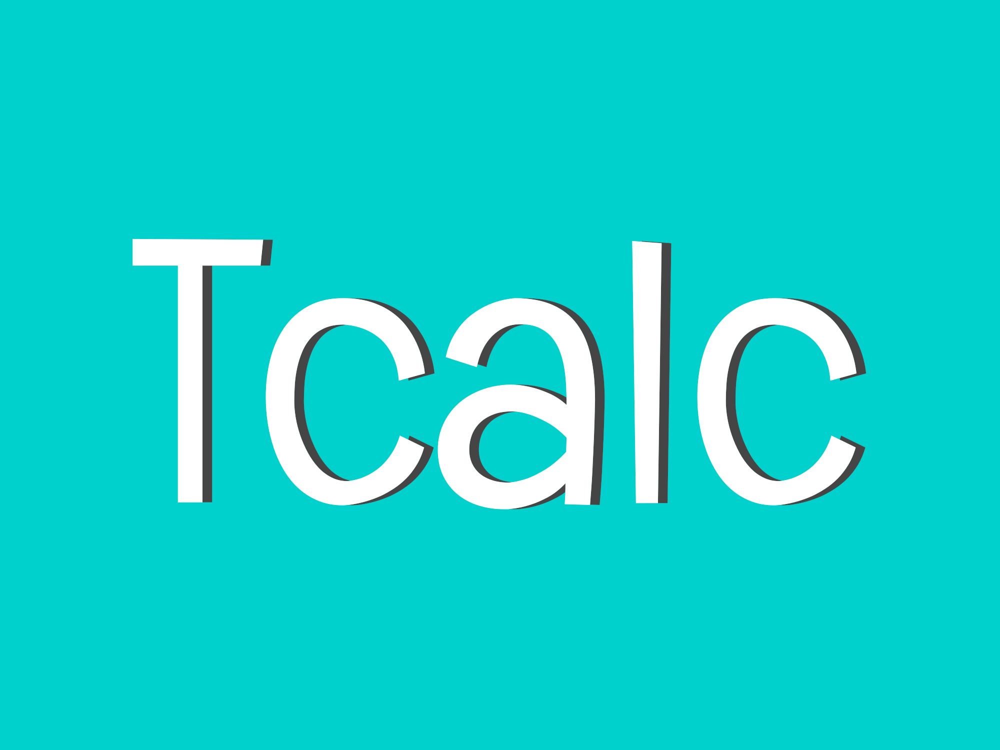

[![Contributors][contributors-shield]][contributors-url]
[![Forks][forks-shield]][forks-url]
[![Stargazers][stars-shield]][stars-url]
[![Issues][issues-shield]][issues-url]
[![Unlicense License][license-shield]][license-url]

<br />
<div align="center">
  <a href="https://dessera.github.io/tcalc">
    
  </a>

  <h3 align="center">TCALC</h3>

  <p align="center">
    Simple computational programming language.
    <br />
    <a href="https://dessera.github.io/tcalc"><strong>Explore the docs »</strong></a>
    <br />
    <br />
    <a href="https://github.com/Dessera/tcalc/issues/new?labels=bug">Report Bug</a>
    &middot;
    <a href="https://github.com/Dessera/tcalc/issues/new?labels=enhancement">Request Feature</a>
  </p>
</div>

<details>
  <summary>Table of Contents</summary>
  <ol>
    <li>
      <a href="#about-the-project">About The Project</a>
      <ul>
        <li><a href="#built-with">Built With</a></li>
      </ul>
    </li>
    <li>
      <a href="#getting-started">Getting Started</a>
      <ul>
        <li><a href="#prerequisites">Prerequisites</a></li>
        <li><a href="#installation">Installation</a></li>
      </ul>
    </li>
    <li><a href="#usage">Usage</a></li>
    <li><a href="#roadmap">Roadmap</a></li>
    <li><a href="#contributing">Contributing</a></li>
    <li><a href="#license">License</a></li>
    <li><a href="#contact">Contact</a></li>
    <li><a href="#acknowledgments">Acknowledgments</a></li>
  </ol>
</details>

## About The Project

TCALC is a simple interpreter for calculators, which can perform basic arithmetic operations with functions (builtin and user-defined), written in C++ and GNU++26.

### Built With

- [![C++26][cpp-shield]][cpp-url]

## Getting Started

For now, the project only supports GCC-14 because I have not tested it on other compilers (I will test it later).

### Prerequisites

The project is based on `meson` and `ninja`, so you need to install them first.

### Installation

1. Clone the repository:

  ```bash
  git clone https://github.com/Dessera/tcalc.git
  cd tcalc
  ```

2. Use `meson` to build the project:

  ```bash
  meson setup builddir
  cd builddir
  meson compile
  ```

3. Install the product:

  ```bash
  meson install --skip-subprojects
  ```

## Usage

Temporarily REPL is available as a command line tool `tcalc_repl`.

For APIs, read the [docs](https://dessera.github.io/tcalc) for more information.

## Roadmap

- [ ] More built-in functions
- [ ] GUI application
- [x] User-defined functions (don't support recursion because no control flow statements)

## Contributing

Contributions are what make the open source community such an amazing place to learn, inspire, and create. Any contributions you make are **greatly appreciated**.

1. Fork the Project
2. Create your Feature Branch (`git checkout -b feature/AmazingFeature`)
3. Commit your Changes (`git commit -m 'Add some AmazingFeature'`)
4. Push to the Branch (`git push origin feature/AmazingFeature`)
5. Open a Pull Request

## License

Distributed under the LGPL-3.0 License. See `COPYING` and `COPYING.LESSER` for more information.

## Contact

Dessera - [@Dessera](https://github.com/Dessera)

Project Link: [https://github.com/Dessera/tcalc](https://github.com/Dessera/tcalc)

## Acknowledgments

- [Let's Build A Simple Interpreter](https://ruslanspivak.com/lsbasi-part1)
- [othneildrew/Best-README-Template](https://github.com/othneildrew/Best-README-Template)

[contributors-shield]: https://img.shields.io/github/contributors/Dessera/tcalc.svg?style=for-the-badge
[contributors-url]: https://github.com/Dessera/tcalc/graphs/contributors
[forks-shield]: https://img.shields.io/github/forks/Dessera/tcalc.svg?style=for-the-badge
[forks-url]: https://github.com/Dessera/tcalc/network/members
[stars-shield]: https://img.shields.io/github/stars/Dessera/tcalc.svg?style=for-the-badge
[stars-url]: https://github.com/Dessera/tcalc/stargazers
[issues-shield]: https://img.shields.io/github/issues/Dessera/tcalc.svg?style=for-the-badge
[issues-url]: https://github.com/Dessera/tcalc/issues
[license-shield]: https://img.shields.io/github/license/Dessera/tcalc.svg?style=for-the-badge
[license-url]: https://github.com/Dessera/tcalc/blob/master/COPYING.LESSER
[cpp-shield]: https://img.shields.io/badge/C++-00599C?style=for-the-badge&logo=c%2B%2B&logoColor=white
[cpp-url]: https://en.cppreference.com/w/cpp
